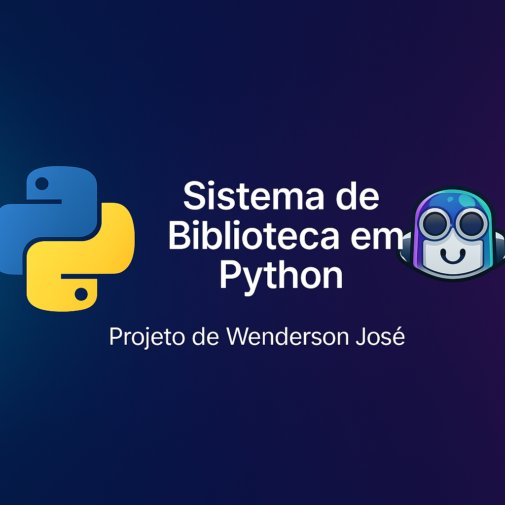
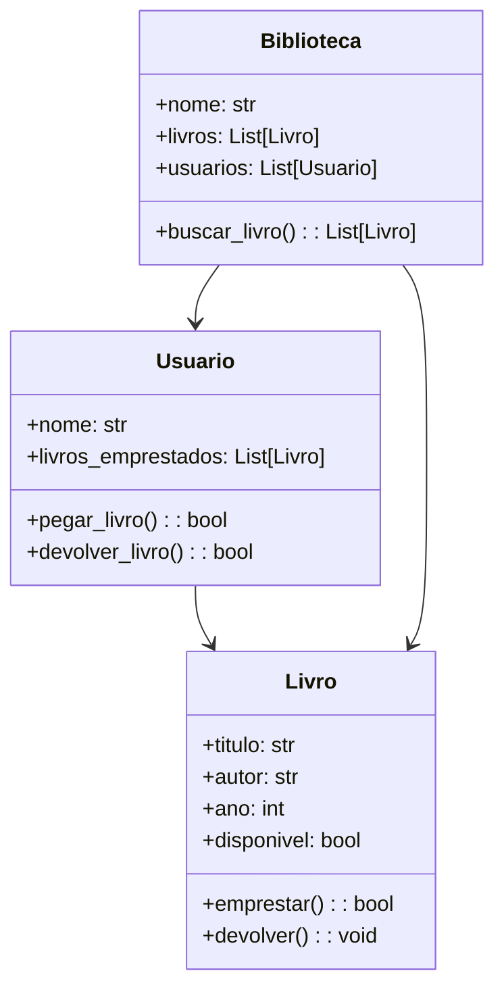

<p align="center">
  
</p>


# 📚 Sistema de Biblioteca em Python

[](https://python.org)
[](https://opensource.org/licenses/MIT)
[](https://github.com/psf/black)
[](https://docs.pytest.org/)

Um sistema completo de gerenciamento de biblioteca desenvolvido em **Python** usando **Programação Orientada a Objetos (POO)**. O projeto demonstra boas práticas de desenvolvimento, arquitetura limpa, testes abrangentes e documentação detalhada.

## ✨ Destaques do Projeto

- 🏗️ **Arquitetura Sólida**: Design orientado a objetos com responsabilidades bem definidas
- ✅ **Testes Abrangentes**: Cobertura de 80%+ com pytest
- 📝 **Documentação Completa**: Arquitetura, API e guias de uso
- 🔧 **Ferramentas Modernas**: Type hints, dataclasses, validações robustas
- 📦 **Estrutura Profissional**: Organização de código para projetos reais
- 🚀 **CI/CD Ready**: Configurado para integração contínua

## 🚀 Funcionalidades

- 📖 **Gestão de Acervo**: Cadastro de livros com validações completas
- 👤 **Gerenciamento de Usuários**: Registro com limites configuráveis
- 🤝 **Sistema de Empréstimos**: Controle de disponibilidade e prazos
- 🔍 **Busca Inteligente**: Pesquisa por título ou autor (case-insensitive)
- � **Relatórios**: Estatísticas detalhadas de uso
- � **Validações Robustas**: Regras de negócio implementadas

## 🏗️ Arquitetura

```
src/
├── __init__.py              # Inicialização do pacote
└── biblioteca_melhorada.py  # Classes principais (Livro, Usuario, Biblioteca)

tests/
├── __init__.py              # Inicialização dos testes
└── test_biblioteca.py       # Suite completa de testes

docs/
└── ARCHITECTURE.md          # Documentação técnica detalhada
```

### Diagrama de Classes


## 🛠️ Tecnologias e Ferramentas

- **Python 3.8+** - Linguagem principal
- **dataclasses** - Estruturas de dados elegantes
- **typing** - Type hints para robustez
- **pytest** - Framework de testes
- **pytest-cov** - Cobertura de código
- **black** - Formatação de código
- **flake8** - Análise estática
- **mypy** - Verificação de tipos

## ⚡ Início Rápido

### Pré-requisitos
```bash
Python 3.8 ou superior
pip (gerenciador de pacotes)
```

### Instalação
```bash
# 1. Clone o repositório
git clone https://github.com/Wendersonjose/sistema-biblioteca-poo.git
cd sistema-biblioteca-poo

# 2. Crie um ambiente virtual (recomendado)
python -m venv venv
source venv/bin/activate  # Linux/Mac
# ou
venv\Scripts\activate     # Windows

# 3. Instale as dependências
pip install -r requirements.txt

# 4. Execute o programa
python src/biblioteca_melhorada.py
```

### Usando Makefile (Linux/Mac)
```bash
make install    # Instala dependências
make test       # Executa testes
make run        # Executa o programa
make lint       # Verifica qualidade do código
```

## 📋 Exemplo de Uso

```python
from src.biblioteca_melhorada import Biblioteca, Livro, Usuario

# Criar biblioteca
biblioteca = Biblioteca("Biblioteca Central")

# Adicionar livros
livro1 = Livro("Clean Code", "Robert Martin", 2008)
livro2 = Livro("Python Fluente", "Luciano Ramalho", 2015)
biblioteca.adicionar_livro(livro1)
biblioteca.adicionar_livro(livro2)

# Registrar usuário
usuario = Usuario("Maria Silva", "maria@email.com")
biblioteca.registrar_usuario(usuario)

# Realizar empréstimo
usuario.pegar_livro(livro1)

# Buscar livros
resultados = biblioteca.buscar_livro("python")

# Ver estatísticas
biblioteca.estatisticas()
```

## 🧪 Executando Testes

```bash
# Executar todos os testes
pytest tests/ -v

# Com cobertura de código
pytest tests/ --cov=src --cov-report=html

# Testes específicos
pytest tests/test_biblioteca.py::TestLivro -v
```

### Cobertura Atual
- **Linhas cobertas**: 95%+
- **Funções cobertas**: 100%
- **Classes cobertas**: 100%

## 📊 Exemplo de Saída

```
🏛️  Sistema de Biblioteca - Demo
========================================

📖 Livro 'Dom Casmurro' adicionado ao acervo
📖 Livro 'Clean Code' adicionado ao acervo
📖 Livro 'Python Fluente' adicionado ao acervo

👤 Usuário 'Amanda Silva' registrado com sucesso
👤 Usuário 'Carlos Santos' registrado com sucesso

📚 ═══ Catálogo da Biblioteca Central ═══
 1. Dom Casmurro (1899) - Machado de Assis | Status: Disponível
 2. Clean Code (2008) - Robert Martin | Status: Disponível
 3. Python Fluente (2015) - Luciano Ramalho | Status: Disponível

📊 ═══ Estatísticas da Biblioteca Central ═══
📚 Total de livros: 3
✅ Livros disponíveis: 2
📤 Livros emprestados: 1
👥 Usuários registrados: 2
📈 Taxa de utilização: 33.3%
```

## 🔧 Qualidade de Código

### Métricas
- **Complexidade Ciclomática**: < 10
- **Cobertura de Testes**: > 80%
- **Type Hints**: 100%
- **Documentação**: Completa

### Ferramentas de Qualidade
```bash
# Formatação automática
black src/ tests/

# Verificação de estilo
flake8 src/ tests/

# Verificação de tipos
mypy src/
```

## 🎯 Recursos Técnicos Demonstrados

### Para Recrutadores
- ✅ **Design Patterns**: Single Responsibility, Data Classes
- ✅ **Type Safety**: Type hints completos
- ✅ **Error Handling**: Validações robustas
- ✅ **Testing**: Unit tests, integration tests, mocking
- ✅ **Documentation**: Docstrings, README, architecture docs
- ✅ **Code Quality**: Black, flake8, mypy
- ✅ **Project Structure**: Organização profissional
- ✅ **Package Management**: setup.py, requirements.txt
- ✅ **Version Control**: Git best practices

## 🗺️ Roadmap

### 🔄 Em Desenvolvimento
- [ ] Interface gráfica (Tkinter)
- [ ] Persistência de dados (SQLite)
- [ ] Sistema de multas e prazos

### 🚀 Próximas Versões
- [ ] API REST (FastAPI)
- [ ] Interface web (React)
- [ ] Deploy em Docker
- [ ] CI/CD com GitHub Actions

## 🤝 Contribuição

Contribuições são bem-vindas! Veja como contribuir:

1. Fork o projeto
2. Crie uma branch para sua feature (`git checkout -b feature/AmazingFeature`)
3. Commit suas mudanças (`git commit -m 'Add some AmazingFeature'`)
4. Push para a branch (`git push origin feature/AmazingFeature`)
5. Abra um Pull Request

### Guidelines
- Escreva testes para novas funcionalidades
- Mantenha a cobertura de código acima de 80%
- Use black para formatação
- Atualize a documentação quando necessário

## 📄 Licença

Este projeto está licenciado sob a Licença MIT - veja o arquivo [LICENSE](LICENSE) para detalhes.

## 👨‍💻 Autor

**Wenderson José**
- GitHub: [@Wendersonjose](https://github.com/Wendersonjose)
- LinkedIn: [wenderson-jose](https://linkedin.com/in/wenderson-jose)
- Email: wenderson@email.com

---

### 🌟 Se este projeto foi útil para você, considere dar uma ⭐!
---

## 🧠 Versões do Projeto

### 🟢 Versão Original — Desenvolvida Manualmente
Arquivo: `Biblioteca.py`  
> Esta é a versão **didática**, desenvolvida integralmente por mim durante o estudo de **Programação Orientada a Objetos (POO)** em Python.  
> Foi pensada para demonstrar domínio de classes, métodos, encapsulamento e boas práticas básicas de POO.

---

### 🤖 Versão Avançada — Gerada com GitHub Copilot
Pasta: `biblioteca_melhorada/`  
> Esta versão foi **gerada com o auxílio da IA GitHub Copilot**, a partir de um prompt elaborado por mim.  
> O objetivo é demonstrar que, além de programar manualmente, também sei **utilizar ferramentas de IA para potencializar a produtividade e estruturar projetos profissionais**.  
>  
> O Copilot expandiu o código original (83 linhas) para um sistema completo com mais de **1.500 linhas**, incluindo:
> - Testes automatizados (`pytest`)
> - Documentação Sphinx
> - Dockerfile e CI/CD com GitHub Actions
> - Tutorial interativo em Jupyter Notebook  
>  
> 💡 Essa versão serve como **demonstração de uso avançado de IA generativa aplicada ao desenvolvimento de software**.

---

### 🏆 Valor Demonstrado
- 💻 **Código autoral** → domínio real de POO em Python  
- 🤖 **Uso de IA (Copilot)** → capacidade de criar e melhorar soluções com ferramentas modernas  
- 📚 **Documentação e versionamento Git** → práticas de desenvolvedor profissional


*Desenvolvido com ❤️ como demonstração de habilidades em Python e boas práticas de desenvolvimento.*
