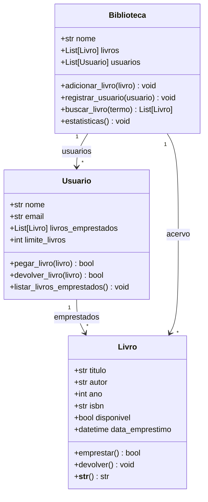

# 📋 Documentação Técnica - Sistema de Biblioteca

## 🏗️ Arquitetura do Sistema

### Visão Geral
O sistema utiliza **Programação Orientada a Objetos (POO)** com três classes principais que interagem entre si:



## 🔧 Componentes Detalhados

### Classe Livro
- **Responsabilidade**: Representa um livro individual
- **Características**:
  - Validação de dados na inicialização
  - Controle de estado (disponível/emprestado)
  - Rastreamento de data de empréstimo
  - Validação de ano e campos obrigatórios

### Classe Usuario
- **Responsabilidade**: Gerencia usuários e seus empréstimos
- **Características**:
  - Limite de livros por usuário (configurável)
  - Histórico de livros emprestados
  - Validações de empréstimo/devolução

### Classe Biblioteca
- **Responsabilidade**: Orquestra todo o sistema
- **Características**:
  - Gerenciamento do acervo
  - Cadastro de usuários
  - Funcionalidades de busca
  - Relatórios e estatísticas

## 🎯 Padrões de Design Utilizados

### 1. **Single Responsibility Principle (SRP)**
Cada classe tem uma responsabilidade específica e bem definida.

### 2. **Data Classes**
Uso de `@dataclass` para reduzir boilerplate e melhorar legibilidade.

### 3. **Type Hints**
Tipagem completa para melhor documentação e detecção de erros.

### 4. **Validation Pattern**
Validações centralizadas em `__post_init__` para garantir integridade dos dados.

## 🔒 Validações e Regras de Negócio

### Livro
- Título e autor não podem estar vazios
- Ano deve ser válido (não negativo e não futuro)
- ISBN é opcional
- Controle automático de disponibilidade

### Usuario
- Nome não pode estar vazio
- Limite máximo de 3 livros por usuário
- Email é opcional
- Não pode emprestar livro já emprestado por ele

### Biblioteca
- Nome não pode estar vazio
- Não permite usuários duplicados (case-insensitive)
- Busca case-insensitive por título ou autor

## 🧪 Estratégia de Testes

### Cobertura de Testes
- **Testes Unitários**: Cada método de cada classe
- **Testes de Validação**: Todos os cenários de erro
- **Testes de Integração**: Fluxos completos do sistema
- **Testes de Borda**: Casos extremos e limites

### Ferramentas
- **pytest**: Framework de testes
- **pytest-cov**: Cobertura de código
- **Mocking**: Para isolamento de testes

## 📊 Métricas de Qualidade

### Objetivo: 80%+ de Cobertura
```bash
# Executar testes com cobertura
pytest tests/ --cov=src --cov-report=html
```

### Análise Estática
```bash
# Verificar qualidade do código
flake8 src/ tests/
mypy src/
```

## 🚀 Performance e Escalabilidade

### Complexidade Algorítmica
- **Busca de livros**: O(n) - busca linear
- **Empréstimo/Devolução**: O(1) - operações diretas
- **Listagem**: O(n) - iteração simples

### Possíveis Otimizações
1. **Índices**: Implementar hashmap para busca O(1)
2. **Caching**: Cache de resultados de busca
3. **Persistência**: Banco de dados para grandes volumes
4. **API**: Interface REST para acesso remoto

## 🔮 Roadmap de Melhorias

### Versão 1.1
- [ ] Persistência em SQLite
- [ ] Interface gráfica (Tkinter)
- [ ] Exportação de relatórios (PDF/Excel)

### Versão 1.2
- [ ] API REST (FastAPI)
- [ ] Autenticação de usuários
- [ ] Sistema de multas

### Versão 2.0
- [ ] Interface web (React)
- [ ] Microserviços
- [ ] Deploy em cloud

## 🛠️ Ambiente de Desenvolvimento

### Pré-requisitos
```bash
Python 3.8+
pip
virtualenv (recomendado)
```

### Setup Completo
```bash
# Clone e setup
git clone <repo>
cd sistema-biblioteca
python -m venv venv
source venv/bin/activate  # Linux/Mac
# ou
venv\Scripts\activate     # Windows

# Instalar dependências
pip install -r requirements.txt
pip install -e .

# Executar testes
make test

# Executar aplicação
make run
```

## 📈 Monitoramento e Logs

### Métricas Importantes
- Taxa de utilização do acervo
- Usuários mais ativos
- Livros mais populares
- Tempo médio de empréstimo

### Logging (Futuro)
```python
import logging
logging.basicConfig(level=logging.INFO)
logger = logging.getLogger(__name__)
```

## 🤝 Contribuição

### Code Review Checklist
- [ ] Testes para nova funcionalidade
- [ ] Documentação atualizada
- [ ] Type hints completos
- [ ] Cobertura de testes mantida
- [ ] Padrões de código seguidos